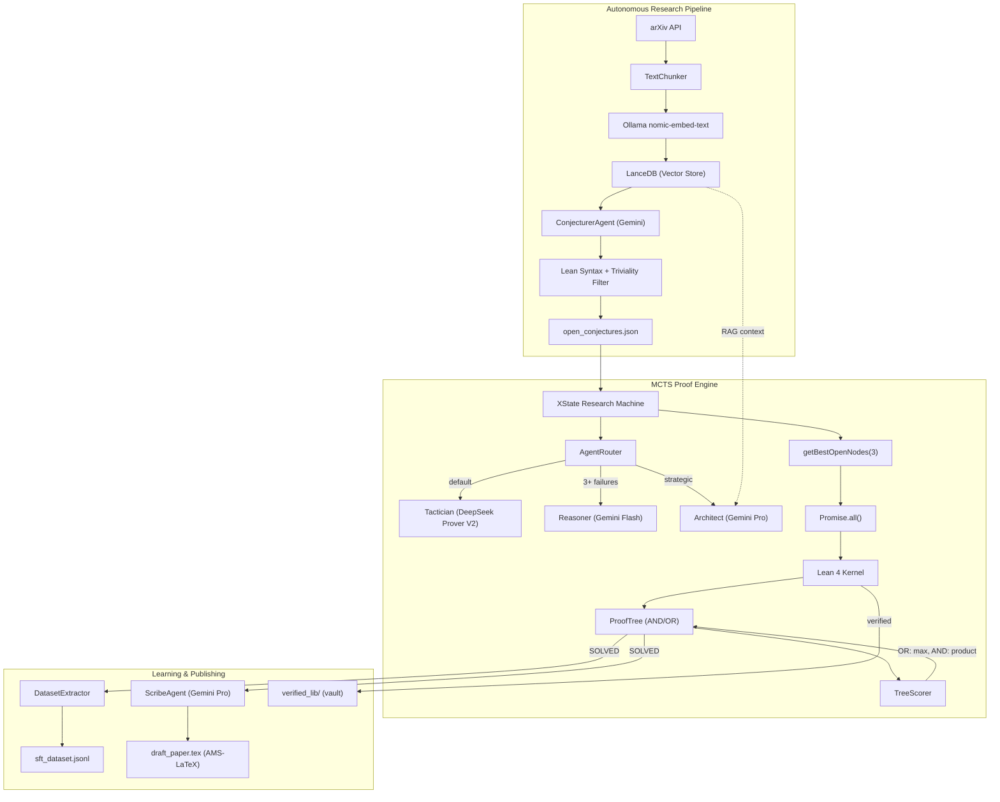

# Perqed

**Automated theorem proving in Lean 4.** An open-source neuro-symbolic research lab that reads mathematical literature, generates conjectures, attempts proofs via MCTS-guided tactic search, and extracts training data from successful proofs — orchestrated by a reactive XState v5 state machine.

Runs locally on Apple Silicon.

## Featured Results: Torus Decompositions
If you are reviewing the paper *Machine-Checked Proofs of the m=4 and m=6 Directed Hamiltonian Torus Decompositions*, please find the corresponding Lean 4 kernel proofs and raw code below:

- **Paper**: [`torus_decomposition.pdf`](projects/torus-decomposition/paper/arxiv/torus_decomposition.pdf)
- **Lean proofs**: [`TorusTopologyM4.lean`](projects/torus-decomposition/paper/arxiv/anc/TorusTopologyM4.lean) ($m=4$) · [`TorusTopologyM6.lean`](projects/torus-decomposition/paper/arxiv/anc/TorusTopologyM6.lean) ($m=6$)

*(Note: Perqed is a general automated reasoning system. The Torus-specific search engine and results have been neatly packaged into `projects/torus-decomposition/`.)*

## Architecture



## Autonomous Research Pipeline (Mathematician in a Box)

Perqed includes a fully autonomous research orchestration loop powered by an **XState v5 reactive state machine**. By providing a single natural-language prompt, the machine coordinates 8 specialized actors through a 10-state DAG:

1. **Literature Seeding**: The Librarian fetches relevant arXiv papers to ground the research.
2. **Planning**: Formulates a concrete, plausible extension hypothesis inspired by the seed literature.
3. **Empirical Investigation**: The Explorer agent synthesizes C/Python scripts and runs them across safe, timeout-enforced subprocess sandboxes across multiple mathematical domains to seek empirical signal or counterexamples.
4. **Conjecture Generation**: Synthesizes the literature context and empirical evidence into precise Lean 4 theorem signatures.
5. **Adversarial Red-Teaming**: An independent Red Team auditor attempts to poke holes in the conjecture. Conjectures that are too broad or easily falsified are either rejected or forcefully weakened (up to 3 rounds of iterative revision).
6. **Formal Verification**: Approved conjectures are sent to the MCTS proof engine to attempt formal Lean 4 verification.

To run the pipeline:
```bash
perqed prompt="find a recent arXiv paper on spectral graph theory and conjecture an extension"
```

Use `--dry-run` to execute the entire pipeline up to the final proof stage (saves time and compute when evaluating the orchestrator).

The machine will transition through: `Idle → Ideation → Validation → EmpiricalSandbox → FormalVerification → ScribeReport → Done`, with automatic error recovery, SMT resolution for plateaus, and falsification forks for counter-examples.

## How It Works

Perqed's underlying solvers have two continuous operational modes:

### Combinatorial Witness Search

1. **Formulate** — The ARCHITECT (Gemini) reads the prompt (e.g. `R(4,6) >= 36`) and emits a structured search config: vertex count, clique parameters, iteration budget, and strategy.

2. **Fast Path** — Z3 checks whether a circulant graph witnesses the bound. Typically returns UNSAT in under 2 minutes, ruling out the entire circulant subspace.

3. **Simulated Annealing** — An 8-worker island model runs SA on the full unconstrained coloring space. A corrected energy function jointly penalizes excess cycles and in-degree violations, preventing false `E=0` readings on non-Hamiltonian functional graphs. Workers cool on independent schedules; the coolest workers exploit, the hottest explore.

4. **Memetic Vault** — Whenever a new global-best graph is found, it is immediately serialized to `best_seed.json`. This survives kills, reboots, and cross-machine transfers. The next run warm-starts W0 from the vault.

5. **LNS Finisher** — At budget exhaustion, Z3 receives the top-3 candidate graphs and attempts to complete each by solving a neighborhood of free edges via SMT. SAT = witness found; UNSAT = that basin is provably sterile and recorded in `journal.json`.

6. **ARCHITECT Pivot** — The ARCHITECT reads all recorded failure modes and issues a new search config (larger budget, different seed strategy, or structural constraints).

### Formal Proof Search

1. **Read the Literature** — The Librarian fetches papers from arXiv, chunks abstracts at sentence boundaries, embeds them via Ollama `nomic-embed-text`, and stores vectors in LanceDB.

2. **Generate Conjectures** — The Conjecturer (Gemini) synthesizes Lean 4 theorem signatures from embedded literature. A dual-stage filter removes syntax errors and trivially solvable theorems.

3. **Falsify First** — Before proof search begins, Z3 checks for counterexamples in bounded domains. False conjectures are typically caught in under 50ms.

4. **AND/OR MCTS Search** — The Orchestrator selects batches of open nodes concurrently via `Promise.all()`. Tactics like `induction` that split into subgoals create AND nodes (all must succeed), while alternative tactics create OR nodes (any can succeed). The TreeScorer backpropagates: OR = max(children), AND = product(children).

5. **Lean as Ground Truth** — Lean 4 verifies every tactic step. The LLM reads tactic state and proposes tactics; Lean checks each one before it is committed.

6. **Training Data Extraction** — Solved proofs are parsed into `(State, Tactic)` pairs and saved as deduplicated SFT training data in `sft_dataset.jsonl`.

7. **Paper Generation** — A separate agent translates verified Lean 4 proofs into AMS-LaTeX documents with theorem environments and numbered equations.

## Quick Start

```bash
# One-command setup (installs Bun, Lean 4, Z3, Ollama, pulls models)
./scripts/setup.sh

# Set up Gemini API key (get from https://aistudio.google.com/apikey)
cp .env.example .env
# Edit .env and add your GEMINI_API_KEY

# Link the CLI globally so you can use 'perqed' from anywhere
npm link

# Run the test suite
bun test

# Run a live autonomous mathematical research pipeline
perqed prompt="find a recent paper on algebraic topology..."

# Run a specific local proof search (backward compatible)
perqed my_experiment_run --live
```

## CLI Reference & Prompts

The `perqed` CLI is the main entry point to the neuro-symbolic lab. It supports fully autonomous orchestration (via XState v5) as well as classic backward-compatible local proof modes.

### Autonomous Research (XState v5)

To start the autonomous research pipeline, simply pass a natural-language description of what you want to investigate. 

**Basic Usage:**
```bash
perqed prompt="investigate Ramsey R(4, 6) upper bounds using Paley graphs"
```

**Literature-Grounded Discovery:**
```bash
perqed prompt="find a recent arXiv paper on spectral graph theory and conjecture an extension"
```

**Open-Ended Exploration:**
```bash
perqed prompt="is there a non-trivial relationship between the Riemann zeta function zeroes and random matrix theory that can be formally stated?"
```

#### CLI Flags for Autonomous Mode

*   `--dry-run`
    Executes the entire research pipeline—literature search, hypothesis generation, empirical sandboxing, and adversarial red-teaming—but **stops before attempting the formal Lean 4 proof**. Highly recommended for quickly evaluating the generated conjectures (usually completes in <1 minute) without burning MCTS compute time.
    ```bash
    perqed prompt="explore properties of strongly regular graphs" --dry-run
    ```

*   `--cross-pollinate`
    Instructs the Architect agent to actively synthesize concepts from entirely distinct mathematical branches.
    ```bash
    perqed prompt="look at knot theory" --cross-pollinate
    ```
    If passed *without* a prompt, it defaults to a global discovery mission:
    ```bash
    perqed --cross-pollinate
    ```

### Classic Local Proof Engine (Backward Compatible)

The classic mode bypasses the autonomous research front-end entirely. It sets up an empty workspace with an `objective.md` and attempts to prove it via the MCTS engine.

*   **Mock Mode (No LLM, structural only):**
    ```bash
    perqed my_experiment_run
    ```

*   **Live Mode (Uses local Ollama models for tactics):**
    ```bash
    perqed my_experiment_run --live
    ```

### Environment Variables

| Variable | Description | Default |
|----------|-------------|---------|
| `GEMINI_API_KEY` | **Required** for the autonomous pipeline and Architect escalation. | *None* |
| `PERQED_WORKSPACE` | The root directory where research outputs and workspaces are saved. | `./agent_workspace` |
| `OLLAMA_ENDPOINT` | The API endpoint for the local tactic generator. | `http://localhost:11434/api/chat` |
| `OLLAMA_MODEL` | The model tag used by Ollama. | `qwen2.5-coder` |

## Model Stack

| Role | Model | Tier | Purpose |
|------|-------|------|---------| 
| **Tactician** | `deepseek-prover-v2:7b-q8` | Local | Lean 4 tactic generation |
| **Reasoner** | `gemini-2.5-flash` | Cloud (free) | Strategic unblock after tactic failures |
| **Architect** | `gemini-2.5-flash` → `gemini-3.1-pro-preview` | Cloud | Proof planning, directives (escalates on failure) |
| **Scribe** | `gemini-3.1-pro-preview` | Cloud (paid) | Lean 4 → AMS-LaTeX translation |
| **Embedder** | `nomic-embed-text` | Local | 768-dim vectors for RAG |

> [!NOTE]
> Cloud models use a 3-tier escalation to keep costs down: `gemini-2.5-flash` (free) → `gemini-3.1-flash-lite-preview` (paid flash) → `gemini-3.1-pro-preview` (break glass). Most proof runs stay on the free tier.

> [!IMPORTANT]
> Gemini requires an API key from [AI Studio](https://aistudio.google.com/apikey). Copy `.env.example` to `.env` and add your `GEMINI_API_KEY`. The free tier (5-15 RPM) is sufficient for proof runs.

## Project Structure

```
perqed/
├── src/
│   ├── orchestration/              # XState v5 research state machine
│   │   ├── machine.ts              # 10-state reactive machine
│   │   ├── actors.ts               # 8 fromPromise actor wrappers
│   │   ├── runner.ts               # Public API: runResearchMachine()
│   │   └── types.ts                # Context, events, actor output types
│   ├── orchestrator.ts             # MCTS proof loop (specialist routing + async batch)
│   ├── tree.ts                     # ProofTree — AND/OR MCTS with value backpropagation
│   ├── lean_bridge.ts              # Lean 4 subprocess + goal parsing
│   ├── lean_ast_validator.ts       # Mathlib definition guardrail
│   ├── solver.ts                   # Native SMT-LIB2 bridge (Z3)
│   ├── agents/                     # Router, formalist, conjecturer, scribe, red_team
│   ├── math/optim/                 # Shared SA framework (IState, SimulatedAnnealing)
│   └── cli.ts                      # CLI entry point
├── projects/
│   ├── torus-decomposition/        # Knuth m=4, m=6 — SA engine, Lean proofs, paper
│   └── erdos-gyarfas/              # EG conjecture — graph search, Lean, Z3
├── tests/
│   └── orchestration/              # XState machine topology tests (8 tests)
└── website/                        # perqed.com (Astro)
```


## License

MIT
