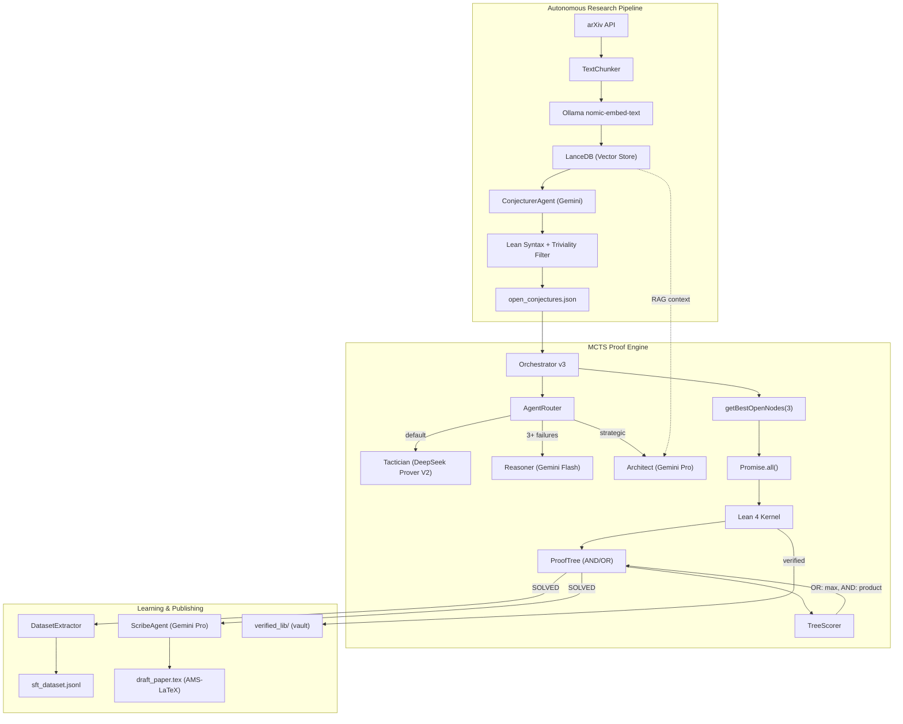

# Perqed

**Automated theorem proving and formal verification in Lean 4.** An open-source system that reads mathematical literature, generates conjectures, attempts proofs via MCTS-guided tactic search, and extracts training data from successful proofs.

Runs locally on Apple Silicon.

---

## Results

### Directed Hamiltonian Torus Decomposition

We provide machine-checked proofs of the $m=4$ and $m=6$ cases of the Directed Hamiltonian Torus Decomposition problem, originally posed by Knuth. The witnesses were discovered via Simulated Annealing and formally verified inside the Lean 4 kernel using the `decide` tactic.

| Case | Vertices | Search space | Discovery time | Kernel verification |
|------|----------|--------------|----------------|---------------------|
| m=4  | 64       | 6^63         | 3.1 s          | < 1 s               |
| m=6  | 216      | 6^215        | 99.5 s         | 57 s                |

Together with Knuth's odd-*m* construction and the Aquino-Michaels construction for even *m* ≥ 8, this closes the problem for all *m* ≥ 3.

- **Paper**: [`paper/torus_decomposition.pdf`](paper/torus_decomposition.pdf)
- **Lean proofs**: [`src/lean/TorusTopology.lean`](src/lean/TorusTopology.lean) (m=4), [`src/lean/TorusTopologyM6.lean`](src/lean/TorusTopologyM6.lean) (m=6)

---

## Proof Engine

The core system reads mathematical literature, generates conjectures, and attempts to prove them in Lean 4 using MCTS-guided tactic search.



### How it works

1. **Read** — Fetch papers from arXiv, chunk abstracts, embed via `nomic-embed-text`, store in LanceDB.
2. **Falsify** — Z3 checks for counterexamples in bounded domains before proof search begins.
3. **Search** — AND/OR MCTS selects batches of open nodes concurrently. Tactics like `induction` create AND nodes; alternatives create OR nodes.
4. **Verify** — Lean 4 checks every tactic step. The LLM proposes; Lean decides.
5. **Learn** — Solved proofs are parsed into (State, Tactic) pairs for SFT training data.

---

## Quick Start

```bash
# One-command setup (installs Bun, Lean 4, Z3, Ollama, pulls models)
./scripts/setup.sh

# Set up Gemini API key (get from https://aistudio.google.com/apikey)
cp .env.example .env
# Edit .env and add your GEMINI_API_KEY

# Run the test suite
bun test

# Run a live proof
bun run src/scripts/live_fire.ts
```

## Model Stack

| Role | Model | Runtime | Purpose |
|------|-------|---------|---------|
| **Tactician** | `deepseek-prover-v2:7b-q8` | Local | Lean tactic generation |
| **Reasoner** | Gemini 2.5 Flash | Cloud | Strategic unblock after failures |
| **Architect** | Gemini 3.1 Pro | Cloud | Proof planning, directives |
| **Conjecturer** | Gemini 3.1 Pro | Cloud | Theorem hypothesis generation |
| **Embedder** | `nomic-embed-text` | Local | 768-dim vectors for RAG |

> [!NOTE]
> `deepseek-prover-v2:7b-q8` requires manual GGUF install — Q8_0 quantization is critical (Q4_K_M produces unusable output). See [Modelfile.prover](Modelfile.prover) for the Ollama configuration.

## Project Structure

```
perqed/
├── src/
│   ├── orchestrator.ts           # Main proof loop (specialist routing + async batch)
│   ├── tree.ts                   # ProofTree — AND/OR MCTS with value backpropagation
│   ├── lean_bridge.ts            # Lean 4 subprocess + goal parsing
│   ├── agents/                   # Router, formalist, conjecturer, scribe
│   ├── math/                     # Simulated Annealing engine + energy evaluators
│   ├── lean/                     # Lean 4 formal proofs (torus m=4, m=6)
│   └── scripts/                  # CLI entry points
├── paper/
│   └── torus_decomposition.tex   # Manuscript (LaTeX source + PDF)
├── data/
│   ├── claude_cycles_m4.json     # m=4 witness payload
│   └── claude_cycles_m6.json     # m=6 witness payload
└── tests/                        # Test suite
```

## License

MIT
