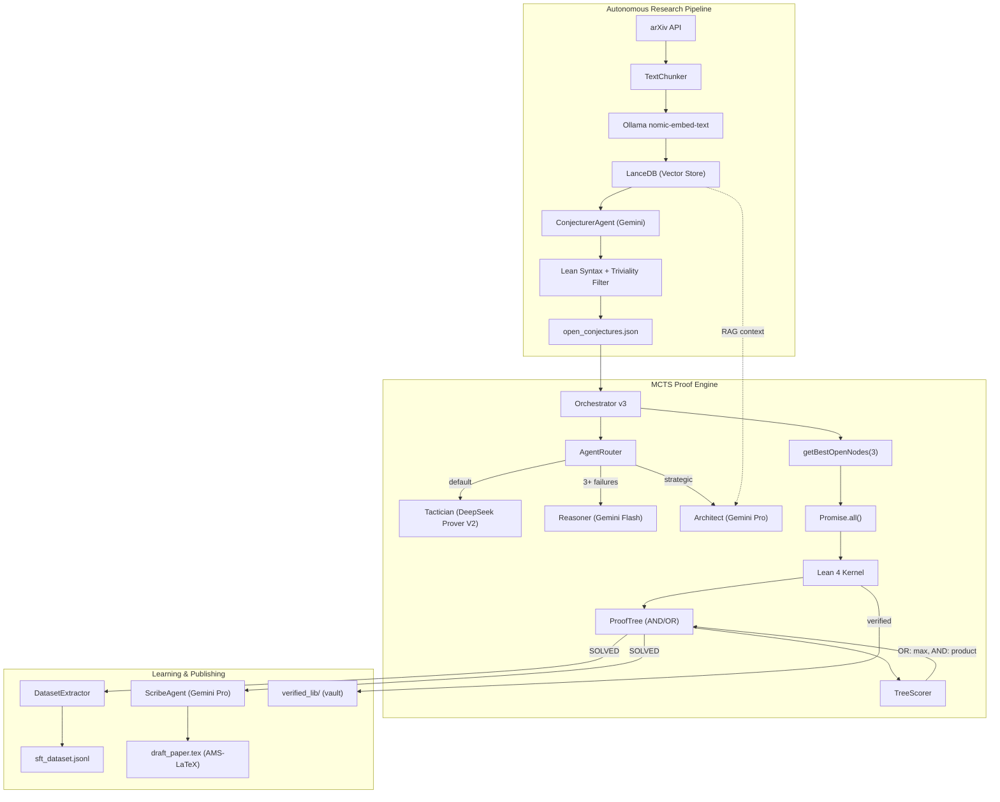

# Perqed

**Automated theorem proving in Lean 4.** An open-source system that reads mathematical literature, generates conjectures, attempts proofs via MCTS-guided tactic search, and extracts training data from successful proofs.

Runs locally on Apple Silicon.

## Architecture



## How It Works

1. **Read the Literature** — The Librarian fetches papers from arXiv, chunks abstracts at sentence boundaries, embeds them via Ollama `nomic-embed-text`, and stores vectors in LanceDB.

2. **Generate Conjectures** — The Conjecturer (Gemini) synthesizes Lean 4 theorem signatures from embedded literature. A dual-stage filter removes syntax errors and trivially solvable theorems.

3. **Falsify First** — Before proof search begins, Z3 checks for counterexamples in bounded domains. False conjectures are typically caught in under 50ms.

4. **AND/OR MCTS Search** — The Orchestrator selects batches of open nodes concurrently via `Promise.all()`. Tactics like `induction` that split into subgoals create AND nodes (all must succeed), while alternative tactics create OR nodes (any can succeed). The TreeScorer backpropagates: OR = max(children), AND = product(children).

5. **Lean as Ground Truth** — Lean 4 verifies every tactic step. The LLM reads tactic state and proposes tactics; Lean checks each one before it is committed.

6. **Training Data Extraction** — Solved proofs are parsed into `(State, Tactic)` pairs and saved as deduplicated SFT training data in `sft_dataset.jsonl`.

7. **Paper Generation** — A separate agent translates verified Lean 4 proofs into AMS-LaTeX documents with theorem environments and numbered equations.

## Quick Start

```bash
# One-command setup (installs Bun, Lean 4, Z3, Ollama, pulls models)
./scripts/setup.sh

# Set up Gemini API key (get from https://aistudio.google.com/apikey)
cp .env.example .env
# Edit .env and add your GEMINI_API_KEY

# Run the test suite
bun test

# Run a live proof
bun run src/scripts/live_fire.ts

# Generate conjectures from arXiv literature
bun run src/scripts/generate_conjectures.ts
```

## Model Stack

| Role | Model | Speed | Purpose |
|------|-------|-------|---------|
| **Tactician** | `deepseek-prover-v2:7b-q8` | 1-2s | Raw Lean tactic generation |
| **Reasoner** | Gemini 2.5 Flash | Cloud | Strategic unblock after failures |
| **Architect** | Gemini 3.1 Pro | Cloud | Proof planning, directives |
| **Conjecturer** | Gemini 3.1 Pro | Cloud | Novel theorem hypothesis generation |
| **Scribe** | Gemini 3.1 Pro | Cloud | Lean 4 → AMS-LaTeX translation |
| **Embedder** | `nomic-embed-text` | Local | 768-dim vectors for RAG |

> [!NOTE]
> `deepseek-prover-v2:7b-q8` requires manual GGUF install — Q8_0 quantization is critical (Q4_K_M produces unusable output). See [Modelfile.prover](Modelfile.prover) for the Ollama configuration.

> [!IMPORTANT]
> Gemini requires an API key from [AI Studio](https://aistudio.google.com/apikey). Copy `.env.example` to `.env` and add your `GEMINI_API_KEY`. The free tier (5-15 RPM) is sufficient for proof runs.

## Project Structure

```
perqed/
├── src/
│   ├── orchestrator.ts           # Main proof loop (specialist routing + async batch)
│   ├── tree.ts                   # ProofTree — AND/OR MCTS with value backpropagation
│   ├── lean_bridge.ts            # Lean 4 subprocess + goal parsing
│   ├── agents/                   # Router, formalist, conjecturer, scribe
│   ├── math/optim/               # Shared SA framework (IState, SimulatedAnnealing)
│   └── scripts/                  # CLI entry points
├── projects/
│   ├── torus-decomposition/      # Knuth m=4, m=6 — SA engine, Lean proofs, paper
│   └── erdos-gyarfas/            # EG conjecture — graph search, Lean, Z3
├── tests/                        # Core engine test suite (370 tests)
└── website/                      # perqed.com (Astro)
```

## Notable Results

Machine-checked Lean 4 proofs of the *m*=4 and *m*=6 cases of the Directed Hamiltonian Torus Decomposition problem (Knuth, March 2026). Together with existing constructions for odd *m* and even *m* ≥ 8, this closes the problem for all *m* ≥ 3.

- **Paper**: [`torus_decomposition.pdf`](projects/torus-decomposition/paper/torus_decomposition.pdf)
- **Lean proofs**: [`TorusTopologyM4.lean`](projects/torus-decomposition/lean/TorusTopologyM4.lean) (*m*=4) · [`TorusTopologyM6.lean`](projects/torus-decomposition/lean/TorusTopologyM6.lean) (*m*=6)

## License

MIT
