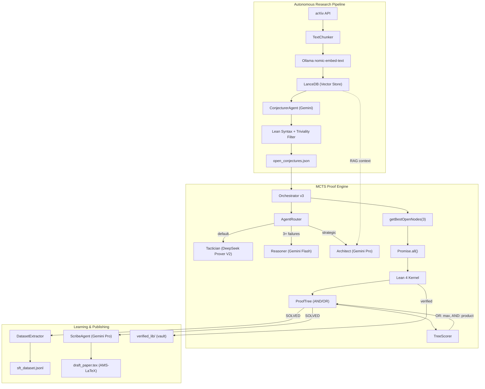

# Perqed

**Automated theorem proving in Lean 4.** An open-source system that reads mathematical literature, generates conjectures, attempts proofs via MCTS-guided tactic search, and extracts training data from successful proofs.

362 tests. Runs locally on Apple Silicon.

## Architecture



## How It Works

1. **Read the Literature** — The Librarian fetches papers from arXiv, chunks abstracts at sentence boundaries, embeds them via Ollama `nomic-embed-text`, and stores vectors in LanceDB.

2. **Generate Conjectures** — The Conjecturer (Gemini) synthesizes Lean 4 theorem signatures from embedded literature. A dual-stage filter removes syntax errors and trivially solvable theorems.

3. **Falsify First** — Before proof search begins, Z3 checks for counterexamples in bounded domains. False conjectures are typically caught in under 50ms.

4. **AND/OR MCTS Search** — The Orchestrator selects batches of open nodes concurrently via `Promise.all()`. Tactics like `induction` that split into subgoals create AND nodes (all must succeed), while alternative tactics create OR nodes (any can succeed). The TreeScorer backpropagates: OR = max(children), AND = product(children).

5. **Lean as Ground Truth** — Lean 4 verifies every tactic step. The LLM reads tactic state and proposes tactics; Lean checks each one before it is committed.

6. **Training Data Extraction** — Solved proofs are parsed into `(State, Tactic)` pairs and saved as deduplicated SFT training data in `sft_dataset.jsonl`.

7. **Paper Generation** — A separate agent translates verified Lean 4 proofs into AMS-LaTeX documents with theorem environments and numbered equations.

## Quick Start

```bash
# One-command setup (installs Bun, Lean 4, Z3, Ollama, pulls models)
./scripts/setup.sh

# Set up Gemini API key (get from https://aistudio.google.com/apikey)
cp .env.example .env
# Edit .env and add your GEMINI_API_KEY

# Run the test suite
bun test   # 362 tests, 54 files

# Seed the vector database
bun run src/scripts/seed_mathlib.ts

# Run a live proof
bun run src/scripts/live_fire.ts

# Generate conjectures from arXiv literature
bun run src/scripts/generate_conjectures.ts
```

## Manual Setup

| Tool | Install | Purpose |
|------|---------|---------| 
| [Bun](https://bun.sh) | `curl -fsSL https://bun.sh/install \| bash` | Runtime + tests |
| [Lean 4](https://lean-lang.org) | `curl -sSf https://raw.githubusercontent.com/leanprover/elan/master/elan-init.sh \| sh -s -- -y` | Proof engine |
| Z3 | `pip3 install z3-solver` | SMT solver |
| [Ollama](https://ollama.com) | `brew install ollama` (macOS) or `curl -fsSL https://ollama.com/install.sh \| sh` (Linux) | Local LLM + embeddings |

```bash
bun install
ollama serve &
ollama pull deepseek-prover-v2:7b-q8
ollama pull nomic-embed-text
bun test  # verify 362/362 green
```

## Model Stack

| Role | Model | Speed | Purpose |
|------|-------|-------|---------|
| **Tactician** | `deepseek-prover-v2:7b-q8` | 1-2s | Raw Lean tactic generation |
| **Reasoner** | Gemini 2.5 Flash | Cloud | Strategic unblock after failures |
| **Architect** | Gemini 3.1 Pro | Cloud | Proof planning, directives |
| **Conjecturer** | Gemini 3.1 Pro | Cloud | Novel theorem hypothesis generation |
| **Scribe** | Gemini 3.1 Pro | Cloud | Lean 4 → AMS-LaTeX translation |
| **Embedder** | `nomic-embed-text` | Local | 768-dim vectors for RAG |

> [!NOTE]
> `deepseek-prover-v2:7b-q8` requires manual GGUF install — Q8_0 quantization is critical (Q4_K_M produces unusable output). See [Modelfile.prover](Modelfile.prover) for the Ollama configuration.

> [!IMPORTANT]
> Gemini requires an API key from [AI Studio](https://aistudio.google.com/apikey). Copy `.env.example` to `.env` and add your `GEMINI_API_KEY`. The free tier (5-15 RPM) is sufficient for proof runs.

## Project Structure

```
perqed/
├── src/
│   ├── orchestrator.ts           # Main proof loop v3 (specialist routing + async batch)
│   ├── tree.ts                   # ProofTree — AND/OR MCTS with value backpropagation
│   ├── workspace.ts              # File-system state (scratch + vault)
│   ├── lean_bridge.ts            # Lean 4 subprocess + goal parsing
│   ├── solver.ts                 # Z3 Python subprocess
│   ├── schemas.ts                # Zod contracts
│   ├── types.ts                  # AgentRole, RoutingSignals, AttemptLog
│   ├── agents/
│   │   ├── router.ts             # Signal-based agent routing
│   │   ├── factory.ts            # SpecialistAgent interface + factory
│   │   ├── formalist.ts          # FormalistAgent (think-tag parsing)
│   │   ├── conjecturer.ts        # Novel theorem hypothesis generation
│   │   └── scribe.ts             # Lean 4 → AMS-LaTeX translator
│   ├── embeddings/
│   │   ├── embedder.ts           # Local Ollama embedding service
│   │   └── vector_store.ts       # LanceDB vector database wrapper
│   ├── ml/
│   │   ├── tree_scorer.ts        # AND/OR value backpropagation
│   │   └── dataset_extractor.ts  # Safe SFT training data harvester
│   ├── utils/
│   │   ├── tree_printer.ts       # MCTS tree visualization
│   │   └── chunker.ts            # Semantic text chunking
│   ├── telemetry/
│   │   └── emitter.ts            # Gist-based telemetry
│   └── scripts/
│       ├── live_fire.ts          # Full integration boss fight
│       ├── publish.ts            # Scribe + SFT pipeline
│       ├── seed_mathlib.ts       # LanceDB seed data
│       ├── arxiv_fetcher.ts      # arXiv ingestion pipeline
│       └── generate_conjectures.ts  # Autonomous conjecture generation
├── tests/                        # 362 tests across 54 files
├── data/
│   ├── sft_dataset.jsonl         # Harvested training pairs
│   └── draft_paper.tex           # Latest AMS-LaTeX output
├── agent_workspace/              # Runtime state
│   ├── global_config/            # System prompts, model config
│   └── runs/<name>/
│       ├── scratch/              # Volatile (lab_log, progress)
│       └── verified_lib/         # Vault (committed .lean proofs)
└── scripts/setup.sh              # One-command bootstrap
```

## Tests

362 tests across 54 files:

| Area | Files | Tests | Coverage |
|------|-------|-------|----------|
| **Routing** | 3 | 38 | Signal extraction, agent routing, integration |
| **Agents** | 4 | 37 | Factory, formalist, architect, council |
| **Lean/Z3** | 3 | 19 | Subprocess, schemas, solver |
| **Workspace** | 3 | 32 | Init, lab log, context, resilience |
| **MCTS Tree** | 4 | 19 | Backtracking, winning path, async batch, AND/OR |
| **Embedding** | 3 | 24 | Embedder, vector store, chunker |
| **ML Pipeline** | 3 | 18 | arXiv, dataset extractor, tree scorer |
| **Orchestrator** | 3 | 15 | Failure counting, directives, concurrent processing |
| **Agents (Cloud)** | 3 | 14 | Conjecturer, scribe, Lean parser |
| **Other** | 15 | 96 | Truncation, LLM client, telemetry, etc. |

## License

MIT
