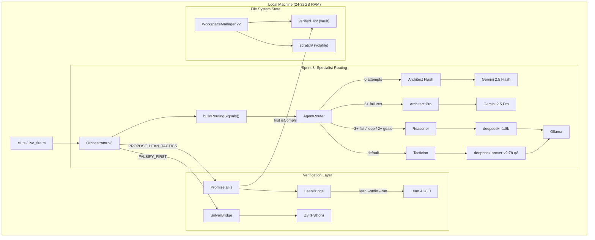

# Perqed

**Neuro-symbolic AI proof engine.** An autonomous orchestrator that uses local LLMs to drive formal mathematical proofs through Lean 4 and Z3.

## Architecture



## How It Works

1. **Falsification First** — Before proving anything, Z3 hunts for counterexamples in a bounded domain. If the theorem is false, we find out in 50ms instead of wasting hours.

2. **Lean-as-DSL** — Lean 4 is the single source of truth for proof state. The LLM reads tactic state, proposes tactics, and Lean verifies them. Z3 is called transparently via `omega`/`smt`.

3. **Parallel Speculation** — Up to 5 tactics per iteration (sorted by confidence), run in parallel via `Promise.all()`. First complete proof wins.

4. **The Vault** — Verified proofs go to `verified_lib/` (append-only, never overwritten). LLM can read but never write here.

5. **Architect Escalation** — After 3 consecutive failures, Gemini analyzes the lab log and redirects strategy.

## Quick Start

```bash
# One-command setup (installs Bun, Lean 4, Z3, Ollama, pulls models)
./scripts/setup.sh

# Set up Gemini API key (get from https://aistudio.google.com/apikey)
cp .env.example .env
# Edit .env and add your GEMINI_API_KEY

# Run the test suite
bun test

# Run your first live proof
bun run src/scripts/live_fire.ts           # R1 (sniper)
bun run src/scripts/live_fire.ts --prover  # Prover-V2 Q8_0 (machine gun)
```

## Manual Setup

| Tool | Install | Purpose |
|------|---------|---------|
| [Bun](https://bun.sh) | `curl -fsSL https://bun.sh/install \| bash` | Runtime + tests |
| [Lean 4](https://lean-lang.org) | `curl -sSf https://raw.githubusercontent.com/leanprover/elan/master/elan-init.sh \| sh -s -- -y` | Proof engine |
| Z3 | `pip3 install z3-solver` | SMT solver |
| [Ollama](https://ollama.com) | `brew install ollama` (macOS) or `curl -fsSL https://ollama.com/install.sh \| sh` (Linux) | Local LLM |

```bash
bun install
ollama serve &
ollama pull deepseek-r1:8b
PATH="$HOME/.elan/bin:$PATH" bun test  # verify 104/104 green
```

## Model Stack

| Role | Model | Speed | Purpose |
|------|-------|-------|---------|
| **Tactician** | `deepseek-prover-v2:7b-q8` | 1-2s | Raw Lean tactic generation (machine gun) |
| **Reasoner** | `deepseek-r1:8b` | ~75s | Strategic analysis, JSON plans (sniper) |
| **Architect (Flash)** | Gemini 3.0 Flash | Cloud | Proof planning, periodic sanity checks |
| **Architect (Pro)** | Gemini 3.1 Pro | Cloud | Heavy structural rethink on total failure |

> [!NOTE]
> `deepseek-prover-v2:7b-q8` requires manual GGUF install — Q8_0 quantization is critical (Q4_K_M produces unusable output). See [Modelfile.prover](Modelfile.prover) for the Ollama configuration.

> [!IMPORTANT]
> Gemini requires an API key from [AI Studio](https://aistudio.google.com/apikey). Copy `.env.example` to `.env` and add your `GEMINI_API_KEY`. The free tier (5-15 RPM) is sufficient for proof runs.

## Project Structure

```
perqed/
├── src/
│   ├── orchestrator.ts       # Main proof loop v3.0 (specialist routing)
│   ├── workspace.ts          # File-system state (scratch + vault)
│   ├── lean_bridge.ts        # Lean 4 subprocess (stdin pipe)
│   ├── solver.ts             # Z3 Python subprocess
│   ├── schemas.ts            # Zod contracts
│   ├── types.ts              # AgentRole, RoutingSignals, AttemptLog
│   ├── architect_client.ts   # Gemini REST API client
│   ├── agents/
│   │   ├── router.ts         # Signal-based agent routing
│   │   ├── factory.ts        # SpecialistAgent interface + factory
│   │   └── formalist.ts      # FormalistAgent (think-tag parsing)
│   └── scripts/live_fire.ts  # Live proof entry point
├── tests/                    # 161 tests (TDD red→green)
├── .env.example              # API key template
├── agent_workspace/          # Runtime state
│   ├── global_config/        # System prompts, model config
│   └── runs/<name>/
│       ├── scratch/          # Volatile (lab_log, progress)
│       └── verified_lib/     # Vault (committed .lean proofs)
└── scripts/setup.sh          # One-command bootstrap
```

## Tests

161 tests across 17 files, all using real subprocesses for Lean and Z3:

| File | Tests | Coverage |
|------|-------|----------|
| `router.test.ts` | 17 | Routing logic, goal parsing, priority rules |
| `routing_signals.test.ts` | 13 | Signal extraction from attempt logs |
| `routing_integration.test.ts` | 8 | Full pipeline: signals → router → factory |
| `architect_tier.test.ts` | 8 | Flash/Pro tier selection, env fallback |
| `factory.test.ts` | 7 | Agent instantiation, API key validation |
| `lean_bridge.test.ts` | 10 | Real Lean subprocess (valid, failed, sorry, timeout) |
| `dual_engine.test.ts` | 10 | Schemas + Lean loop + escalation + vault commit |
| `workspace_v2.test.ts` | 12 | scratch/ + verified_lib/ + commitProof |
| `formalist.test.ts` | 8 | think-tag parsing, bare-tactic wrapping, retry |
| `council.test.ts` | 14 | FALSIFY_FIRST, parallel Z3, confidence scoring |
| `orchestrator.test.ts` | 7 | Failure counting, backtracking, directives |
| `resilience.test.ts` | 4 | Resume, append, max iterations, SOLVED |
| `truncation.test.ts` | 4 | Context window budget, head+tail truncation |
| `llm_client.test.ts` | 8 | JSON parsing, auto-correction |
| `workspace.test.ts` | 16 | Init, lab log, happy path, context builder |
| `solver.test.ts` | 5 | Z3 unsat/sat, timeout, isolation |
| `architect.test.ts` | 5 | Gemini parsing, markdown, validation |

## License

MIT
